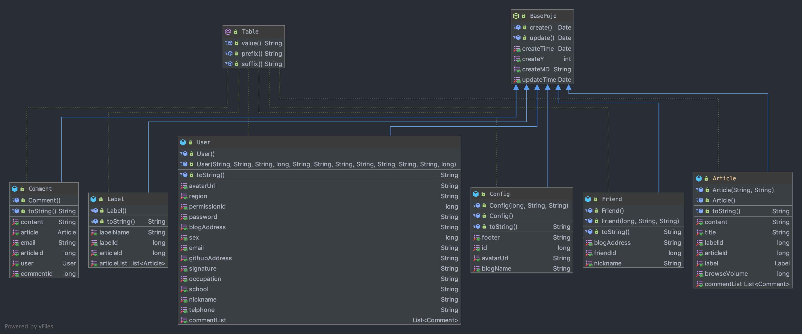
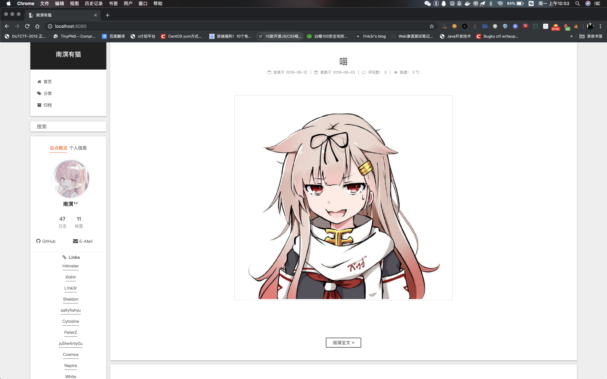
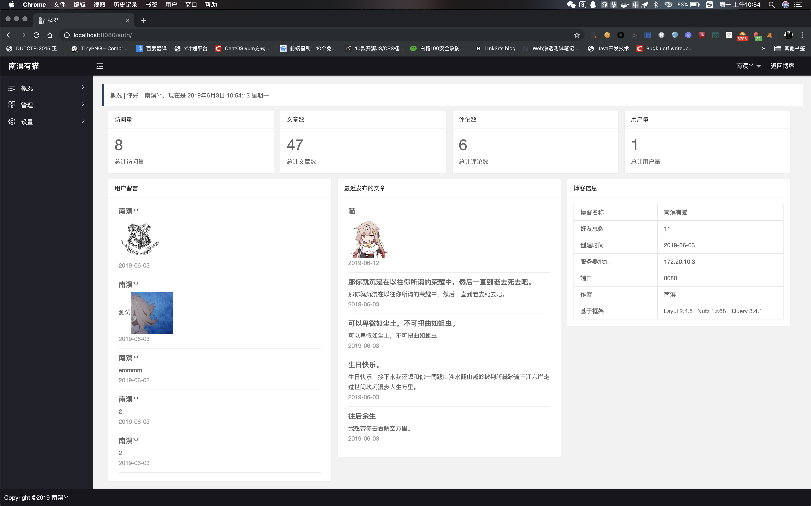
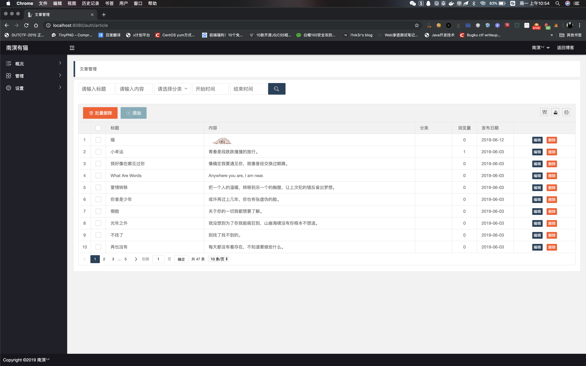
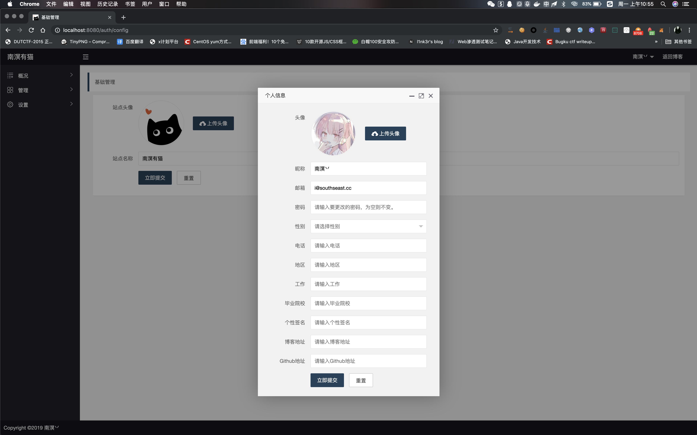

# Blog_System

个人博客系统【一次**JSP**期末项目。Orz

## 关于开发

### 学到的地方

前台UI使用~~致敬~~啊不对是~~移植~~也不对是~~抄袭~~了[**Hexo**](https://hexo.io/)的[**Next**](http://theme-next.iissnan.com/)主题，[**Next**](http://theme-next.iissnan.com/)天下第一！【破音

后台UI使用了**Layui**进行开发，写的过程中一直跟陈老师吐槽说这玩意一点也不人性化想要组件还得自己具体再写。。。【其实是买不起LayuiAdmin，然后自己眼高手低嫌它丑，改来改去累死了。。。不过Ajax真好用。

后端使用了[**Nutz**](http://www.nutzam.com/)框架，一如既往的好用，这次相较于上次的单纯使用数据库部分还是长进了许多，~~虽然每天都被陈老师揪着骂~~。

本来想用Shiro来做权限控制的。。无奈没太看明白，就先做了简单的权限控制来用。

数据库的密码部分使用了MD5加密，重置密码部分的token跟着官方教程使用了3DES加密。

### 不足之处

前端学的太差了- -现在是一想到前端就头痛。。。不想做这个。

Module部分返回的数据类型没有统一【懒得改了。

一些类似邮箱格式验证和密码强度校验懒得写。

其他部分感觉还行。

### 表的结构









导个图来看看，没有使用外键，备份恢复太令人头痛了。

## 关于使用说明

登陆入口在http://localhost:8080/auth

管理员初始密码为i@southseast.cc/south。

管理员/博主对文章/评论/分类/好友/用户/系统设置有着绝对控制权，唯一不能达成的操作是删除自己的账号XD。

普通用户只能在后台查看到概览以及管理自己的评论。

## 其他

使用了**Simditor**作为富文本编辑器。

**resources**下的**mail.properties**需要先填写一下自己的邮箱配置。

```
mail.HostName = smtp.qq.com
mail.SmtpPort = 587
mail.smtp.auth = true
mail.SSLOnConnect = true
mail.charset = UTF-8
mail.UserName =  # 用户名
mail.Password = # QQ邮箱的那个授权码
mail.From = # 邮箱
```

不知道还有啥，，，懒得写了，先这样。